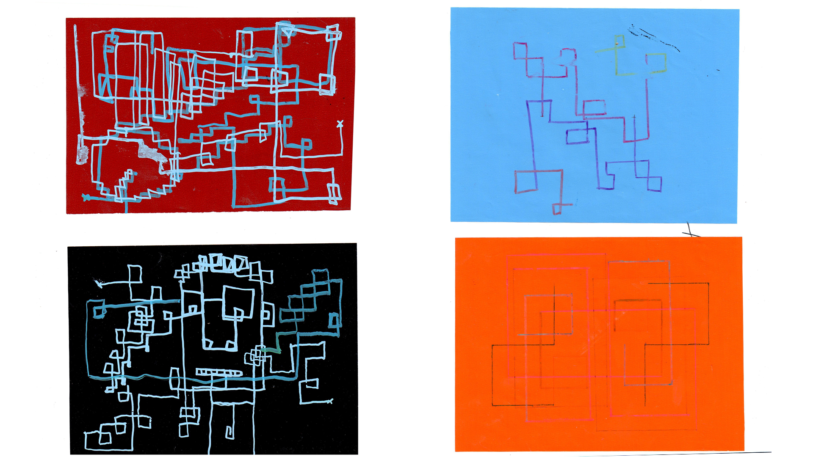

# Readme project_algorithm_BlockParty
Repo for FHP- Course: Input Output (Eingabe Ausgabe) Fundamentals of process-oriented design.

## Analog algorithm
As first step in this course we were working on an analog algorithm which were execute by humans.

### Prerequisite
+ sheet of paper (DIN A4)
+ Pencils in different colours and size

### Usage

Schritt 1

Drehe das Blatt so, dass eine der langen Kanten zu dir gerichtet ist.
Auf dem Blatt bfeinden sich 2 Kreuze, das Linke ist Punkt A, das Rechte ist Punkt B.

Schritt 3

Zeichne von Punkt A aus eine vertikale oder horizontale gerade Linien, Richtung egal. Diese nennen wir Linie A (Beschriftung nicht nötig).
Zeichne eine Linie von gleicher Länge wie Linie A, aber in entgegengesetzter Richtung von Punkt B aus. Diese nennen wir Linie B (Beschriftung nicht nötig).
Zeichne nun immer vom Ende der gezeichneten Linie eine neue Linie die im 90 grad Winkel zu dervorherigen Linie steht.
Du kannst für die Linien Stifte unterschiedlicher Farbe und dicke nehmen, allerdings musst du mit einem Stift immer mind 5 Linie in Folge Zeichnen.

Schritt 4

Wiederhole schritt 3 dreißig mal.

## Digital algorithm
After we did the analog algorithm we tried to convert it into digital form. I choosed pythonScript for Rhino3D for mine. The picture you see below is rendered in Keyshot. The idea is to us the model as a lamp with confusing shadow.

## The result

rendered in Keyshot

### Prerequisite

For Running the Script you will need:
 + [McNeel's Rhinoceros 3D 5](https://www.rhino3d.com/)
 + [IronPython](http://ironpython.net/) (because the script is written in python)

### Dependencies

In the Python Script following modules are used:

 + Rhino.Geometry

### Usage

For running the script you have to do following steps:

1. Start Rhinoceros 3D
2. Command: RunPythonScript
3. Open "Rhino_BlockParty.py"
4. Follow the instructions in the command line
5. If you like the "sculpture" you can save it, e.g. for rendering.
6. Thats it

### The result

### Licence
The MIT License (MIT)

Copyright (c) [2015] [Lukas Schmidt-Wiegand]

Permission is hereby granted, free of charge, to any person obtaining a copy
of this software and associated documentation files (the "Software"), to deal
in the Software without restriction, including without limitation the rights
to use, copy, modify, merge, publish, distribute, sublicense, and/or sell
copies of the Software, and to permit persons to whom the Software is
furnished to do so, subject to the following conditions:

The above copyright notice and this permission notice shall be included in all
copies or substantial portions of the Software.

THE SOFTWARE IS PROVIDED "AS IS", WITHOUT WARRANTY OF ANY KIND, EXPRESS OR
IMPLIED, INCLUDING BUT NOT LIMITED TO THE WARRANTIES OF MERCHANTABILITY,
FITNESS FOR A PARTICULAR PURPOSE AND NONINFRINGEMENT. IN NO EVENT SHALL THE
AUTHORS OR COPYRIGHT HOLDERS BE LIABLE FOR ANY CLAIM, DAMAGES OR OTHER
LIABILITY, WHETHER IN AN ACTION OF CONTRACT, TORT OR OTHERWISE, ARISING FROM,
OUT OF OR IN CONNECTION WITH THE SOFTWARE OR THE USE OR OTHER DEALINGS IN THE
SOFTWARE.